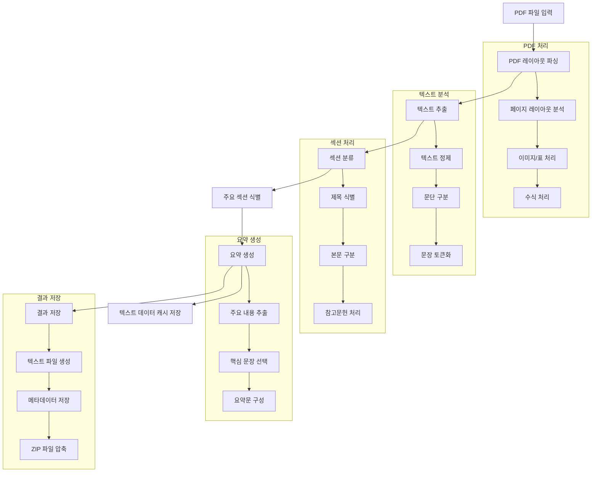

# pdfPaperSummary

arXiv에서 특정 키워드로 논문을 원하는 개수만큼 검색 & PDF를 다운로드 후 각 논문을 Local LLM을 이용한 자동 요약 시스템.

 - repo 정리 필요

## 주요 기능

- arXiv 논문 검색 및 PDF 다운로드
- 날짜별 논문 관리
- 키워드별 논문 분류
- PDF 논문 자동 요약

## 시스템 요구사항

- Python 3.x
- Anaconda 환경 (권장)

## 설치 방법

1. 저장소를 클론합니다:
```bash
git clone [repository-url]
```

2. enviroments.yaml을 이용한 conda env 설정
```
conda env create --file enviroments.yaml
```

3. 필요한 패키지를 설치합니다:
```bash
pip install -r requirements.txt
```

 - 경험적으로 시스템에 따라 cuda, layoutparser, detectron 설치가 매우 어려웠음.

## 사용 방법

`main.sh` 스크립트를 사용하여 시스템을 실행할 수 있습니다:

```bash
./main.sh -k [키워드] -n [논문 개수] -p [arxiv or pmc] # pmc 미구현

# 예시
./main.sh -k "machine learning" -n 5 -p arxiv
```

## 프로세스 흐름

1. **논문 검색 및 다운로드**
   - 입력된 키워드로 arXiv 검색
   - 지정된 개수만큼 PDF 다운로드
   - 날짜별 폴더에 저장 (`Papers/[날짜]/[키워드]`)

2. **논문 요약**
   - 다운로드된 각 PDF 파일에 대해 자동 요약 수행
   - 요약 결과는 `Summarize/[날짜]/[키워드]` 폴더에 저장
   - 이미지를 제외한 텍스트는 캐시로 저장
   - 각 논문별로 개별 폴더 생성 및 ZIP 파일로 압축

### 논문 요약 프로세스 상세 흐름



## Output 구조

```
pdfPaperSummary/
├── Papers/
│   └── [날짜]/
│       └── [키워드]/
│           └── [논문명].pdf
├── Summarize/
│   └── [날짜]/
│       └── [키워드]/
│           └── [논문명]/
│               └── [논문명].zip
├── main.sh
├── PaperCrawling.py
└── PaperSummarize.py
```

## 주의사항

- 실행 전 `main.sh`에 실행 권한을 부여해야 합니다:
  ```bash
  chmod +x main.sh
  ```
- 메일 발송 미구현
- 바이오 계열은 PMC 등의 저널이 필요한데 봇 차단으로 인한 자동화 제약


## Reference
 - https://github.com/ibm-aur-nlp/PubLayNet
 - https://github.com/teddylee777/langchain-kr

